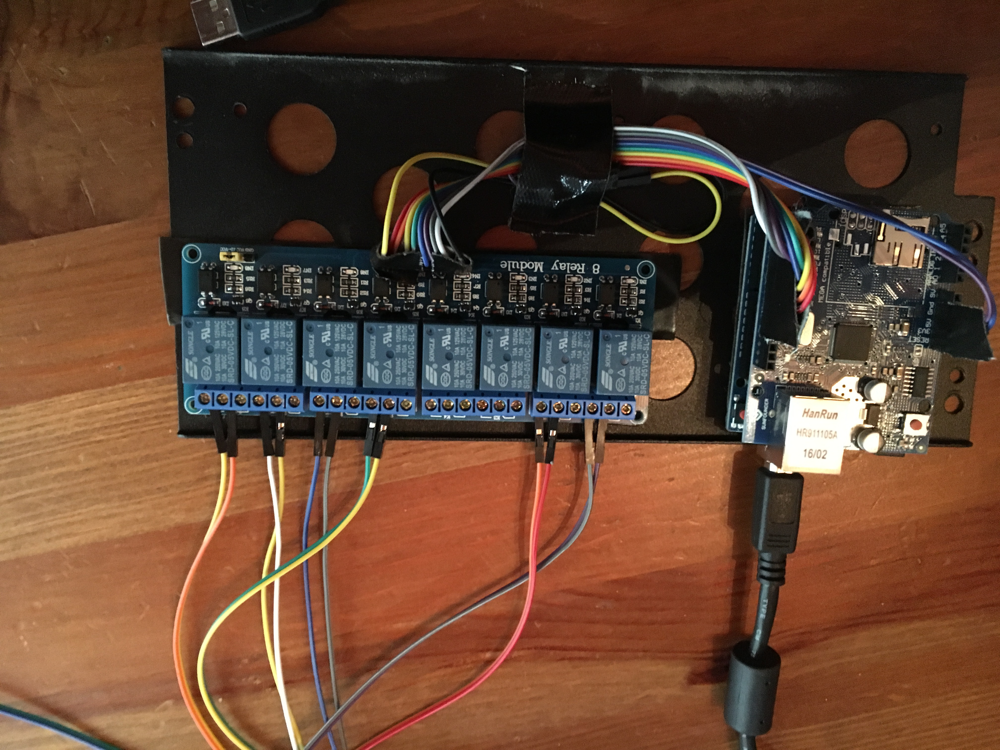

# arduinoRemoteHand

## Problem
GPUs are fickle beasts, especially under linux.  Trying to optimize their perfmance often leads to a hung server, it will respond to pings, but will never ever be able restart itself.  It's a serious hardware fault and the server can't solve it by itself.  

## Solution
Reset your hung servers with this ugly thing!!

Parts:

- $5.00 Arduino UNO
- $7.00 W5100 Ethernet shield 
- $5.00 8-Channel 5V octocoupler relay module 
- $5.00 Assorted jumper wires, usb cable, tape




## Setup

- 1) Simply find the line of code, and change it to the appropriate IP address for your network (DHCP not supported), currently 10.69.69.200.

- 2) Connect the ethernet shield to the UNO, and the UNO's output pins 2-9 to the relay.  Connect 5v and ground as well. 

- 3) Wire up the output lines to the POWER SWITCH connector on your motherboards. Optionally, attach a second to the RESET SWITCH, but I haven't had a reason to go beyond POWER. 

- 4) Power your UNO via USB or external power.

- 5) Connect it to your network via the ethernet shield.

## Usage 
This was built with automation in mind, so it supports a minimal version of HTTP and a simple REST API. This code is built for an 8 port relay, but it's obvious how to extend or shrink to suit your needs. 

To turn on the server connected to relay 5 by closing the circuit for 1 second, try:
```curl 10.70.70.200/5short```

To turn off a hung server on relay 3 by closing the circuit for 10 seconds, try:
```curl 10.70.70.200/3long```

You will then need to turn it back on again, by running:
```curl 10.70.70.200/3short```


## Conclusion
This was my first arduino project, and it was a lot of fun, and it will save me a lot of time driving to my colo and restarting servers.  I am impressed with how easy it was to make something work.

Let me know if you need any change or help for your use case, otherwise I will probably install this controller in my rack and move on to other work. 

